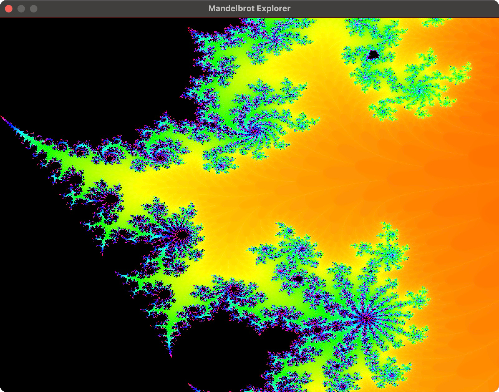

# Mandelbrot Explorer
🚀 Mandelbrot explorer written in Rust 🦀

Explore the fascinating world of the Mandelbrot set with this simple yet powerful explorer written in Rust. Utilizing the `minifb` crate for window management and rendering, this tool allows for real-time interaction with the Mandelbrot set.



## Running

To execute the project, run:

```sh
cargo run --release
```

## Usage

- **Move Around**: Use `WASD` keys.
- **Zoom In**: Press ⬆️.
- **Zoom Out**: Press ⬇️.
- **Reset View**: Press `R`.
- **Exit**: Press `esc`

## Mathematical Background

The Mandelbrot set consists of complex numbers that do not diverge when iterated through the function `f(z) = z^2 + c`, where `z` is the current value and `c` is the initial value. Specifically, the set includes all complex numbers `c` for which the sequence `f(0), f(f(0)), f(f(f(0))), ...` remains bounded.